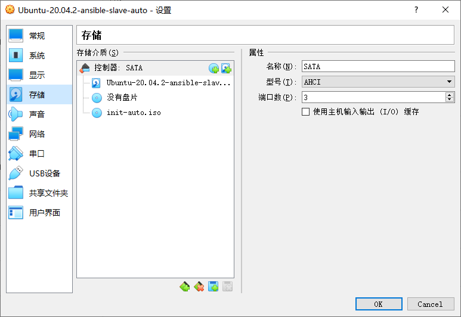

# 实验目的

使用 `cloud-init` 方案，通过对安装方式的自定义，实现系统的无人值守安装。

## 1. 环境配置

### 1.1 镜像构建机

1. 安装依赖工具包

```bash
sudo apt update && sudo apt install cloud-init genisoimage -y
```

2. 将你修改后的 `meta-data` 与 `user-data` 放置到相应的文件夹

```bash
scp meta-data user-data username@192.168.231.8:/file/path
```

3. 创建无人值守安装镜像

```bash
genisoimage -input-charset utf-8 -output init-auto.iso -volid cidata -joliet -rock user-data meta-data
```

4. 新建虚拟机挂载镜像




## 2. 注意

1. 因 `user-data` 已经定义了用户与主机名，所以 `meta-data` 中的配置被忽略
2. 可通过 `apt` 的 `uri` 配置、直接进行镜像源修改
3. `authorized-keys` 部分不需要添加引号
4. 密码为 cuc

## 3. 参考资料

1. [2021-linux-public-caeeee](https://github.com/CUCCS/2021-linux-public-caeeee/blob/chap0x01/chap0x01/chap0x01/%E6%97%A0%E4%BA%BA%E5%80%BC%E5%AE%88%E5%AE%89%E8%A3%85%E9%95%9C%E5%83%8F%E5%AE%9E%E9%AA%8C%E6%8A%A5%E5%91%8A.md)
2. https://mirrors4.tuna.tsinghua.edu.cn/help/ubuntu/
3. https://cloudinit.readthedocs.io/en/latest/topics/examples.html
4. https://github.com/c4pr1c3/LinuxSysAdmin/blob/master/cloud-init.md
5. https://c4pr1c3.github.io/LinuxSysAdmin/cloud-init.md.html#/14/5
6. https://github.com/c4pr1c3/LinuxSysAdmin/blob/a3c3ed18cf38b9e4be1ea53b46efe7f02e4ab8b5/exp/chap0x01/cd-rom/nocloud/user-data
